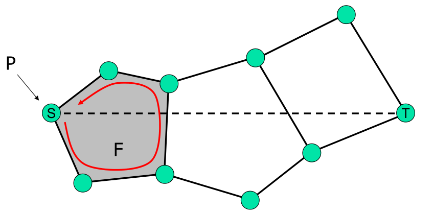

Das gezielte versenden von Nachrichten (**Routing**) in einem WSN muss viele Einschränkungen und Hindernisse überwinden, allen voran die limitierte Energiekapazität und damit verbunden die limitierte Sendereichweite. Dennoch möchten wir ein Routing mit geringem Aufwand, garantierter Zustellung, zyklenfreiheit und guter Qualität der Pfade.

**Errichbarkeit** eines Knotens soll **garantierte Zustellung** gewährleisten. Dazu nehmen wir vereinfachend an, dass jede Nachrichtenübertragung zwischen zwei Knoten erfolgreich ist (**ideal MAC layer**).

# Flooding

**Flooding** ist das simpelste Routingverfahren. Jeder Knoten sendet die Nachricht an jeden seiner Nachbarn weiter. Dass hier Optimierungspotential besteht ist offensichtlich. Im Allgemeinen wollen wir lieber **single path Strategien**, also Routing-Strategien, bei denen es nur einen einzelnen Pfad vom Start zum Ziel gibt.

# Globale vs. Lokale Routing-Strategien

**Globale Routing-Strategien** benutzen Wissen über den gesamten Graphen. Sie können **proaktiv** oder **reaktiv** sein und finden den kürzesten Pfad. Zustellung, zyklenfreiheit und Pfadqualität sind gewährleistet. Allerdings sind sie sehr aufwendig, wenn sie überhaupt möglich sind.

**Lokale Routing-Strategien** benutzen nur ihre 1- (oder k-)hop Nachbar Informationen und merken sich abgehandelten Traffic nicht. Sie sind weniger aufwändig, skalieren gut und Netzwerk-Änderungen betreffen nur Teilbereiche. Allerdings sind Zustellung, zyklenfreiheit und Pfadqualtät hier etwas schwieriger.

# Localized Geographic Greedy Packet Routing

Wir gehen davon aus dass jeder Knoten seine Position kennt und dass der Start-Knoten, der die Nachricht versenden möchte, die Position des Ziels kennt (*nicht ganz klar wie*).

Beim **Greedy Packet Forwarding** wählt jeder Knoten den "besten" Nachbarn als nächsten Hop als Paket. Der "beste" Nachbar wird anhand einer **Metrik** bestimmt. Es gibt verschiedene Metriken. Andere Single-Path Strategien sind **MFR** (*auf den Folien nicht näher beschrieben*) und **DIR** (*nicht verständlich beschrieben*). Zusätzlich kann eine geeignete Topologiekontrolle das Routing verbessern.

Die einfachste Metrik ist die Distanz zum Ziel (**Geo-Routing**). Greedy Geo-Routing ist zyklenfrei.

Basierend auf der Formel für den **Pfadverlust** $u(d) = d^a + c$ (*???*) kann eine andere Metrik definiert werden, die als nächsten Hop den Knoten nimmt, für den direkte Pfadverlust und der geschätzte weitere Pfadverlust zusammen minimal ist.

Eine Metrik basierend auf dem **Cost over Progress Modell** minimiert Verhältnis zwischen den Kosten, zu einem Knoten zu springen, und dem Fortschritt, der mit dem Sprung gemacht werden würde. Dabei ist die Kostenfunktion beliebig.

Um zu vermeiden, dass durch wiederholte Benutzung eines Pfades die beteiligten Knoten schnell ihre Energie verlieren, kann eine Metrik definiert werden, die die **Restenergie** der Knoten berücksichtigt. Diese Metrik kann auch mit einer **Energiekosten**-Metrik kombiniert werden.

Um die Energienutzung noch weiter zu balancieren kann der Nächste Hop auch (ein Stück weit) **per Zufall** gewählt werden. Es wird eine gewisse Vorauswahl getroffen um sicherzustellen, dass der Hop dem Ziel auch (etwas) näher kommt, und dann wird per Zufall ein Knoten ausgewählt. Die Zufallsverteilung kann weiterhin durch eine andere Metrik gewichtet werden.

*TODO: Vorteile, Nachteile, Problem mit Namen nennen*

# Beacon-Less-Routing

Bisher gingen wir davon aus, dass jeder Knoten seine Nachbarn kennt. Um dies zu vermeiden kann **BLR** benutzt werden:

1. Der Startknoten kennt seine Nachbarn nicht
2. Sendet blind einen Broadcast an die umliegenden Knoten
3. Die Knoten antworten nicht sofort
4. Jeder Knoten berechnet für sich selbst die Metrik
5. Je besser die Metrik, desto früher antworten die Knoten

# Der Fehler von Greedy Routing

Ein "dummes" Greedy-Routing zieht keine Rückwärts-Hops in Betracht, obwohl diese zu einem insgesamt besseren Pfad führen könnten. Des Weiteren kann es in "Sackgassen" (im folgenden **konkave Knoten**) laufen und stecken bleiben.

Um trotzdem Greedy-Routing so lange wie möglich zu benutzen, kann man im Falle eines solchen Routing-Fehlers eine **Greedy-Recovery** einschalten. Dafür müssen allerdings bereits gemachte Routing-Entscheidungen gespeichert werden, entweder in den Knoten oder in der Nachricht selbst.

## Flooding-Recovery

Konkave Knoten senden die Nachricht an alle Nachbarn. Bekommen sie die selbe Nachricht noch einmal, ignorieren sie sie, um Nachrichtenschleifen zu vermeiden.

Verbesserung: **Component-Routing**. Der konkave Knoten flooded das vielversprechenste Subset seiner Nachbarn.

## DFS-Based Recovery

Zur Recovery wird eine Tiefensuche (**Depth First Search, DFS**) vom konkaven Knoten gestartet. Die Kotenauswahl kann hierbei wieder auf einer der oben beschriebenen Metriken beruhen.

# Face-Routing

**Face-Routing** unterteilt einen planaren Graphen in **Faces** und besucht dann eine Sequenz von Faces bis zum Ziel. Dazu läuft es die Grenze der Faces mit oder gegen den Uhrzeigersinn entlang (**left/right hand rule**). Der Vorteil von Face-Routing ist, dass es keine Routing-Informationen speichern muss. Es kann als Recovery-Strategie für Greedy-Routing benutzt werden.

## Greedy-Face-Greedy (GFG)

Es wird eine Gerade vom Start zum Zielknoten gezogen. Diese durchläuft zwangsläufig eine Menge Faces, entlang der dann traverisiert werden soll. Der Algorithmus läuft die Grenze eines Faces entlang, bis sie die Gerade schneidet. Dann wechselt er zum nächsten Face.

## Greedy Other Adaptive Face Routing (GOAFR)

Ähnlich wie GFG, aber hier wird jedes Face erstmal komplett abgelaufen, und dann der Knoten ausgewählt, der am nächsten am Ziel liegt. Von diesem wird dann die Gerade neu gezogen und ab diesem traversiert.

# Geographical Cluster Based Routing

Beim **Geographical Cluster Based Routing** wird ein virtuelles Overlay über den Graphen gelegt, um die Knoten zu Clustern/Faces zusammenzufassen. Cluster sind mit einander verbunden, wenn mindestens ein verbundenes Knotenpaar zwischen ihnen gibt. Das Routing folgt dann den Clustern.

Soll der **Overlay-Graph** jedoch auf jeden Fall verbunden sein, müssen Kanten zwischen nicht direkt benachbarten Clustern zugelassen werden, was jedoch wieder die Planarität verletzen könnte.

Ein mögliche Lösung ist der **Purged Aggregated Gabriel Graph**:

1. Erstelle Graphen über Knoten mit UDG
2. Wende GG auf diesen UDG an
3. Aggregiere Cluster durch Overlay

An dieser Stelle kann es jedoch noch irreguläre Schnitte geben:

Um diese los zu werden entfernt man im Beispiel oben die Kante $AC$ und fügt eine **implizite kante** $BC$ ein. *Leider wird nirgends erklärt was das soll und warum man das machen kann.*

# Localized Multicasting

# Reaktive Topologiekontrolle

*TODO, was ist das, was will man erreichen, Beispiel PDT bauen, aber nicht auswendig, warum PDT nachrichtenoptimal, O-Reaktivität angucken, $O_k$-reaktiv, BFP-GG, $\Omega_k-reaktiv$, Redundanzkoexistenz hinmalen können*
