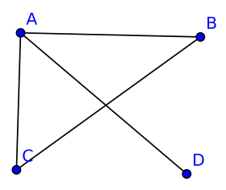
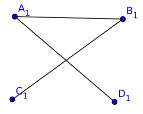
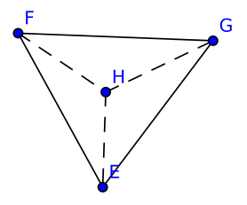
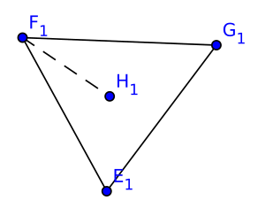

**Redundanz** und **Koexistenz** sind Netzwerkeigenschaften, die oft von realen Netzwerken erfüllt werden und auch vom UDG erfüllt werden.

# Redundanz

Im Falle eines Schnittes ist mindestens ein Endpunkt mit allen anderen verbunden.

## Schwache Redundanz

*???*

# Koexistenz

Sind 3 Knoten mit einander verbunden ist auch jeder Knoten innerhalb des Dreiecks mit allen Punkten verbunden.

## Schwache Koexistenz

Sind 3 Knoten mit einander verbunden ist auch jeder Knoten innerhalb des Dreiecks mit mindestens einem der Punkte verbunden.

