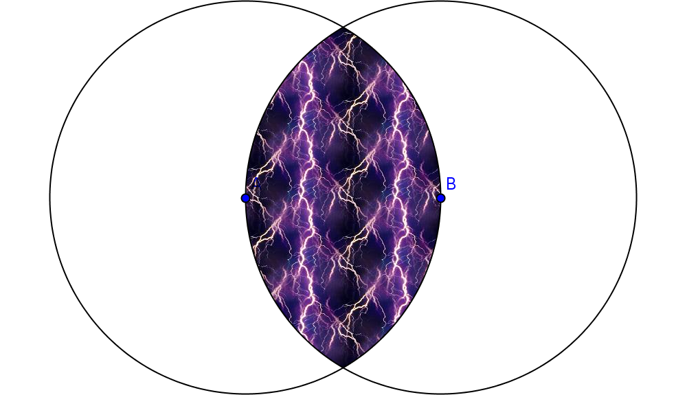
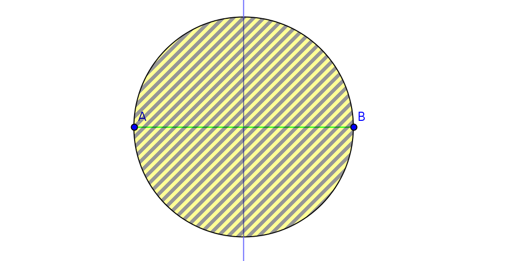
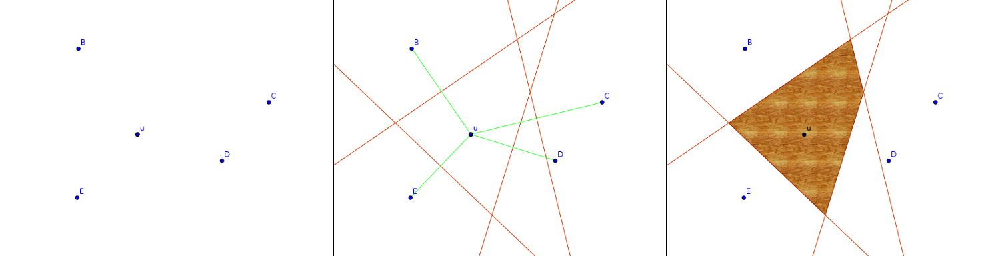
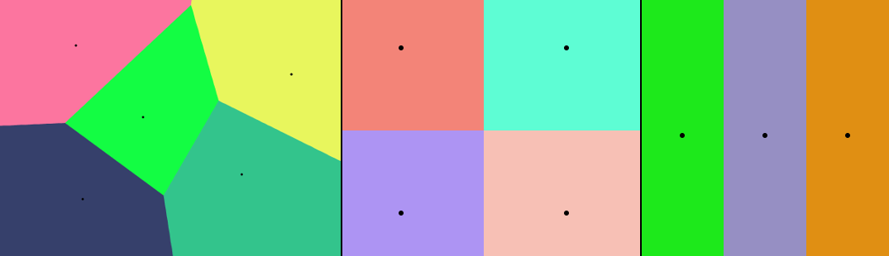
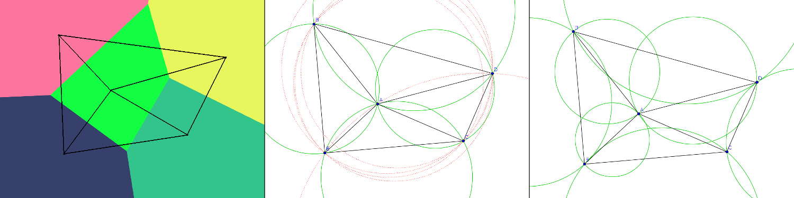
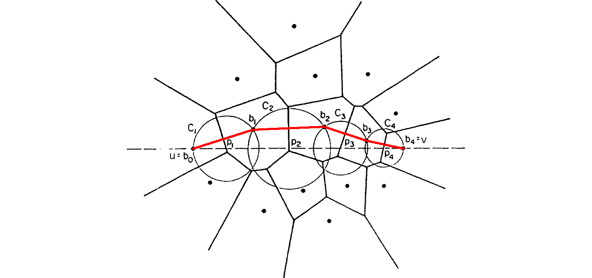
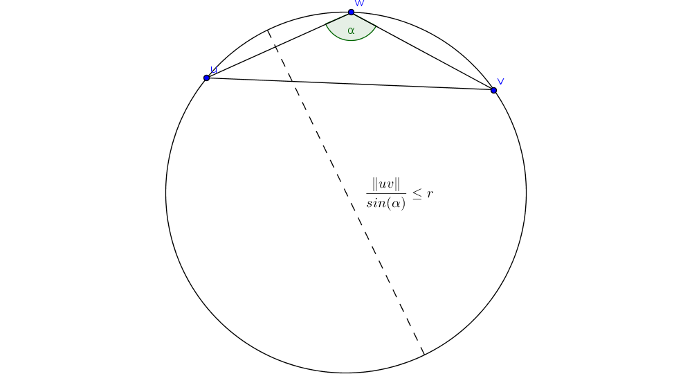

Eine **Topologiekontrolle** ist eine Abbildung $\tau: C \rightarrow D$ eines Graphen $C$ auf einen Graphen $D$. $D$ ist ein Subgraph von $C$. Eine Topologiekontrolle kann Kanten und Knoten entfernen.

Die **k-lokale Sicht** $G[v, k]$ eines Knotens $v$ ist ein Subgraph von $G$, bestehend aus $v$, seinen $k$-hop Nachbarn und den Pfaden zu diesen. Vereinfachung: $G[v]$ ist die 1-lokale-Sicht von $v$.

Eine **k-lokale Topologiekontrolle** ist eine Topologiekontrolle, die nur die k-lokale Sicht eines Knotens betrachtet, um Entscheidungen zu treffen.

# UDG (Unit-Disk Graph)

Ein UDG hat einen Radius $r$. Mit diesem Radius zieht man einen Kreis um eine Knotenmenge $V$. $UDG(V)$ macht dann eine Kante zwischen allen Punkten, die in einander Kreisen liegen.

# QUDG (Quasi-Unit-Disk Graph)

In der Realität kann man nicht einfach um z.B. einen WLAN-Router einen Kreis ziehen und sagen, dass alles im Kreis sich zum Router verbinden kann. Stattdessen nimmt man zwei Radien $r_{min}$ und $r_{max}$ ($r_{min} \leq r_{max}$) und zieht damit zwei Kreise um eine Knotenmenge $V$. Der innere Kreis garantiert eine Verbindung, dahinter nur vielleicht und hinter dem äußeren Kreis gibt es keine Verbindung mehr.

Besonders interessant ist wenn $\frac{r_{max}}{r_{min}} \leq \sqrt{2}$, aber warum das so ist weiß keiner.

# 2D-Geometrie

Der **Bisektor** zweier Punkte $u$ und $v$ ist die Menge aller Punkte, die zu $u$ und $v$ den gleichen Abstand haben: $B(u,v) = bisektor(u,v) = \{x : \|xu\| = \|xv\|\}$

Die **geschlossene Halbebene** zweier Punkte $u$ und $v$ ist die Menge aller Punkte, die näher zu $u$ liegen als zu $v$: $H(u,v) = halfPlane(u, v) = \{x: \|xu\| \leq \|xv\| \}$

Der **Kreis** um einen Punkt $u$ mit dem Radius $r$ ist die Menge aller Punkte, die zu $u$ den Abstand $r$ haben: $C_r(u) = circle(u, r) = \{ x : \|xu\| \leq r \}$. Weitere relevante Kreise sind der Kreis, der die Punkte $u$, $v$ und $w$ umschließt $C(u, v, w) = circle(u, v, w)$ und der kleinste Kreis, der die Punkte $u$ und $v$ umschließt $C(u, v) = circle(u, v)$.

Des Weiteren wird der **Winkel** zwischen zwei Geraden $uv$ und $vw$ wie folgt notiert: $\measuredangle uvw = angle(u, v, w)$

# Spanner

Man nehme zwei beliebige Knoten $p, q \in G$. Dann setzt man den tatsächlich kürzesten Pfad zwischen den beiden Knoten mit der Pfadlänge der Knoten aus $G$ ins Verhältnis. Wenn man dieses Verhältnis auf einen Stretch-Faktor („Umständlichkeit”) $c$ beschränken kann ($O, \Theta, \Omega$), dann ist $G$ ein $c$-Spanner.

Man kann auch die Pfade in zwei Graphen ins Verhältnis setzen und so Spanner über Umwege definieren. Spanner sind nützlich, weil man damit trotz nur eingeschränktem Wissen sich dem kürzesten Pfad annähren kann.

In einem topologischen, gewichteten Graphen $G$ ist der **kürzeste Pfad** $p_{min}$ zwischen zwei Knoten $u$ und $v$ der Pfad, für den die Pfadlänge minimal ist. Er wird wie folgt notiert: $p_{min} = \Gamma_G(u, v)$

In einem euklidischen Graphen ist das Gewicht der Kanten durch die Distanz der Knoten gegeben und der kürzeste Pfad $p_{min}$ wird notiert mit $p_{min} = \Pi_G(u, v)$.

Ein **euklidischer $c$-Spanner** ist ein Graph, bei dem für alle Knoten das Verhältnis zwischen kürzester Pfadlänge und tatsächlicher euklidischer Distanz den **stretch-factor** $c$ nicht überschreitet. Formell:

$$
\forall{u, v \in G}: \frac{\|\Pi_G(u,v)\|}{\|uv\|} \leq c
$$

Sei $H$ ein euklidischer Graph und $G$ ein Subgraph von $H$. Nun wird das Verhältnis zwischen der kürzesten Pfadlänge des Subgraphen und der des ursprünglichen Graphen gemessen. $G$ ist ein **euklidischer Graph-Spanner**, wenn dieser stretch-factor $c$ nie überschreitet:

$$
\forall{u, v} \in G: \frac{\|\Pi_H(u,v)\|}{\|\Pi_G(u,v)\|} \leq c
$$

Für einem topologischen Graphen gilt das gleiche, aber es werden die topologischen Pfadlängen betrachtet:

$$
\forall{u, v \in G}: \frac{|\Gamma_H(u,v)|}{|\Gamma_G(u,v)|}\leq c
$$

Wichtig für die ganzen Teile die folgen: wenn $F \subseteq G \subseteq H$ und $F$ ein $t$-Spanner von $H$, dann ist auch $G$ ein $t$-Spanner. Damit kann man folgende Ungleichung bauen:

$$
LDel^{(1)}(V) \supseteq PlDel(V) \supseteq LDel^{(2)}(V) \supseteq ... \supseteq LDel^{(k)}(V) \supseteq \underbrace{UDel(V)}_{UDG\textmd{-Spanner}}
$$

$$
\underbrace{UDel(V)}_{UDG\textmd{-Spanner}} \subseteq LDel^{(k)}(V) \subseteq ... \subseteq LDel^{(2)}(V) \subseteq PlDel(V) \subseteq LDel^{(1)}(V)
$$

# Planare Graphen

*Graphentheoretisch*: Graph $G$ ist planar, wenn $G$ auf die Ebene gezeichnet werden kann, sodass sich keine Kanten schneiden.

*Definition hier*: Graph $G$ ist als Zeichnung auf der Ebene gegeben. Gesucht ist ein Teilgraph $H$, der keine schneidenden Kanten enthält. Dieser Graph $H$ wird dann als planar bezeichnet.

# EMST (Euclidean Minimal Spanning Tree)

Das euklidische Gewicht eines euklidischen Graphen ist

$$
\|G\| = \sum_{uv \in G} \|uv\|
$$

Der **EMST** über eine Punktemenge $V$ ist der zusammenhängende Graph, für den $\|V\|$ minimal ist. Ist $UDG(V)$ verbunden, so ist $EMST(V) \subseteq UDG(V)$ (*Beweis ausgelassen*). EMST ist jedoch keine k-lokale Topologiekontrolle (*Beweis ausgelassen*).

Der EMST über $V$ lässt sich über den Algorithmus von Kruskal herstellen: Zeichne in jedem Schritt die kurzmöglichste Kante, die keinen Zyklus erzeugen würde, bis der Graph zusammenhängend ist.

# LMST (Local EMST)

Der **LMST** ist eine Graphenstruktur, die „nahe am“ EMST ist. Gegeben sei ein Graph $G$ mit zwei Knoten $u$ und $v$ und der Kante $uv$. Wendet man LMST als Topologiekontrolle an, bleibt $uv$ im Graphen, wenn:

$uv \in LMST(G) \Leftrightarrow uv \in EMST(N(u)) \land uv \in EMST(N(v))$

Das heißt: Wenn $uv$ und $vu$ im EMST über die Nachbarn des jeweils anderen Knotens enthalten sind, bleibt $uv$ bestehen (hier etwas kompliziertere Definition um ungerichtete Graphen mit einzubeziehen).

(*Problem mit gleichen Kantenlängen ausgelassen.*)

Der LMST ist eine 2-lokale Topologiekontrolle (*Beweis ausgelassen*).

Ist $UDG(V)$ verbunden, so ist $EMST(V) \subseteq LMST(V)$ (*Beweis ausgelassen*).

Der LMST hat maximalen Grad 6. [Wikipedia](https://de.wikipedia.org/wiki/Grad_(Graphentheorie)).

# RNG (Relativer Nachbarschaftsgraph)

$V$ sei eine Menge von Punkten, die zu einem Graphen verbunden werden sollen.

$$
uv \in RNG(V) \Leftrightarrow \|uv\| \leq max\{\|uw\|, \|vw\|\} \quad \forall{w \in V \backslash \{u,v\}}
$$

Alternativ: Sei Radius $r = \|uv\|$. Sei $c_u$ die Menge der Punkte im Kreis um $u$ mit Radius $r$: $c_u = circleSet(u, r)$ und $c_v$ das Gleiche für $v$. Dann ist

$$
uv \in RNG(V) \Leftrightarrow \nexists{w \in V}: w \in c_u \cap c_v
$$

Das heißt: Die Schnittmenge (**Lune**) der Kreise um $u$ und $v$ mit mit deren Abstand als Radius enthält keine weiteren Knoten.

Der **Unit- Relativer Nachbarschaftsgraph (URNG)** ist die Schnittmenge aus RNG und UDG:

$$
URNG(V) = RNG(V) \cap UDG(V)
$$

Der URNG ist eine 1-lokale Graphkonstruktion und $LMST(V) \subseteq URNG(V)$ (*Beweis ausgelassen*).

Sei $V$ eine Punktemenge mit $n$ Punkten. Dann ist

$$
\frac{\|\Pi_{URNG}(u,v)\|}{\|\Pi_{UDG}(u,v)\|} \leq n-1
$$

(*??? Keine Ahnung was das soll, Beweis ausgelassen*)

# GG (Gabriel-Graph)

Man malt einen Kreis um jedes Knotenpaar, sodass der Mittelpunkt des Kreises genau zwischen den beiden Punkten liegt. Der $GG(V)$ macht eine Kante zwischen alle Knoten, bei denen kein anderer Knoten im Knotenpaarkreis liegt.

Der **Unit-Gabriel-Graph** $UGG(V) = GG(V) \cap UDG(V)$ ist eine lokale Konstruktion.

# Voronoi-Diagramm

Gegeben sein eine Punktemenge $S$. Die **Voronoi-Region** um einen Punkt $u \in S$ wird konstruiert, indem man die Halbebene zu jedem anderen Punkt in $S$ zeichnet. Alles was auf der Halbebene von $u$ liegt, ist Teil der Voronoi-Region.

Formal:

$$
VR_S(u) = \displaystyle{\bigcap_{v \in S \setminus \lbrace u \rbrace}} H(u, v)
$$

Beispiel:

Das komplette **Voronoi-Diagramm** $VD(S)$ erhält man, wenn man die Regionen aller Punkte vereinigt: $VD(S) = \lbrace VR_S(v) ~|~ v \in S \rbrace$

Kanten, die mehr als eine Region delimitieren, sind die **Voronoi-Kanten**. Sie können Geraden, Halbgeraden oder Strecken sein.

Die Endpunkte der Kanten sind die **Voronoi-Knoten**. Sie haben mindestens 3 ausgehende Kanten. Wenn sie genau 3 Kanten haben, sind sie **nicht-degeneriert** und wenn sie mehr als 3 Kanten haben, sind sie **degeneriert**. Wenn ein Voronoi-Diagramm einen degenerierten Knoten hat, dann ist das ganze Diagramm degeneriert.

Das ganze kann man mit [diesem Simulator](http://alexbeutel.com/webgl/voronoi.html) ausprobieren. Beispielergebnis (farbige Gebiete sind die Voronoi-Regionen, deren Grenzen die Voronoi-Kanten und die Enden der Kanten die Voronoi-Knoten):

# Delaunay-Triangulierung

Drei mögliche Definitionen für $Del(S)$:

1. Verbinden aller Punkte in $S$, deren Voronoi-Region eine gemeinsame Kante haben.

2. Verbinde $u, v, w \in S$, wenn ihr Kreis keine weiteren Punkte enthält.

3. Verbinde $u, v \in S$, wenn es einen Kreis gibt, der die beiden Punkte tangiert, aber keine anderen Punkte beinhaltet. (*Hinweis: Der Kreis muss nicht minimal sein, das wäre dann GG.*)

Die drei Definitionen sind in gewissen Fällen nicht äquivalent. Darum macht man zwei vereinfachende Annahmen über $S$, womit diese Fälle ausgeschlossen werden:

1. **Nicht-Cozirkularität**: es gibt keine vier Punkte, die auf einem Kreis liegen $\Leftrightarrow$ kein Voronai-Knoten ist degeneriert.

2. **Nicht-Colinearität**: es gibt keine drei Punkte, die auf einer Geraden liegen $\Leftrightarrow$ keine Voronai-Kante ist eine Gerade.

Delauny-Triangulierung ist planar und keine lokale Topologie.

# UDel (Unit-Disk-Delaunay-Triangulierung)

$UDel = Del \cap UDG$. Keine lokale Topologie, aber wichtiges Vehikel um Spanning Properties von $k$-lokalen Graphen zeigen zu können.

*TODO: Grundidee Keil-Gutwin-Beweis, Kreissortierung über $\Theta$

$UDel$ ist $UDG$-Spanner.

# DT-Pfade (Delauney-Triangulierungspfade)

TODO: Dobkin Beweis (versteh ich nicht), Trick mit kürzestem Pfad wird evtl. abgefragt*

Ein **direkter DT-Pfad** von $u$ nach $v$ mit $u, v \in S$ schreitet durch die Knoten von benachbarten Voronai-Regionen direkt von $u$ nach $v$. Wenn alle Knoten des Pfades auf einer Seite der Geraden durch $u$ und $v$ liegen, dann ist der Pfad **einseitig**.

Ein einseitiger Pfad hat eine nach oben beschränkte Pfadlänge von $\frac{\pi}{2} \|uv\|$. Er besucht nur Kanten aus $UDG(S)$.

# LDel (Lokale Delaunay-Triangulierung)

Man schränkt $Del$ auf die $k$-Hop-Nachbarn ein. So erhält man $LDel$.

Ein Dreieck mit den Punkten $u, v, w \in S$ ist ein $k$-lokales Dreieck, wenn sie nach $UDG(S)$ verbunden sind und $C(u, v, w)$ keine weiteren Punkte enthält.

$LDel^{(k)}(V)$ besteht aus allen $k$-lokalen Dreiecken und allen Kanten aus $UGG$ (damit der Graph zusammenhängt).

$UDel(S) \subseteq LDel^{(k)}(S) \Rightarrow LDel^{(k)}(S)$ ist ein $UDG$-Spanner. $LDel^{(1)}(V)$ ist nicht unbedingt planar.

# PlDel (Planare Delaunay-Triangulierung)

*TODO, niedrige Priorität, wird nicht unbedingt in der Klausur drauf eingegangen*

# RDG (Restricted Delaunay Graph)

$RDG(V)$ für $UDG(V)$ (*TODO humane Beschreibung*):

$$
uv \in RDG(V) \Leftrightarrow uv \in UDG(V) \wedge \forall w \in N(u) \cap N(v): uv \in Del(N(w))
$$

Eine Kante $uv$ zwischen $u$ und $v$ aus $V$ ist Teil des RDG über $V$ genau dann, wenn $uv$ im UDG über $V$ ist und $uv$ in der Delauney-Triangulierung der Nachbarn von $w$ ist, für jeden Punkt $w$ in der gemeinsamen Nachbarschaft von $u$ und $v$.

Es gilt $UDel(V) \subseteq RDG(V)$.

# PDT (Partielle Delaunay-Triangulierung)

Wir nehmen uns den $UDG(S)$ mit Radius $r$. Die $PLT(S)$ verbindet alle Punkte $u, v \in S$ für die gilt:

1. $\|uv\| < r$

2. Und eins der folgenden Optionen:

    - $uv \in GG(S) \cap UDG(S)$

    - $C(u, v, w) \cap N(u) \setminus \lbrace u, v, w \rbrace = \emptyset$ und $sin(\alpha) \geq \frac{\|uv\|}{r}$, wobei $w \in S \setminus \lbrace u, v \rbrace$ der winkelmaximierende Knoten

$PDL$ ist ein UDG-Spanner und ein UDel-Spanner. Er ist identisch mit dem $PuDel$.

# PuDel (Partielle ungerichtete Delauney-Triangulierung)

*TODO, beim Beweis verstehen wie „somit: PuDel ist $blabla - UDG-Spanner$” funktioniert, Gleichheit PuDel und PDT wird er nicht so genau fragen*

$PuDel$ und $PDT$ sind gleich, wird aber in der Klausur nicht so genau gefragt.

# Das ganze weitere Graphengedöns...

...steht in den Folien. Wichtig sind:

* Ideen des Chu-Lin/Edmunds-Algorithmus

* Backbone

    * Dominating Set

    * Grundidee des Verhaltens (Lightweight Construction)

    * Verbesserungen

    * Erweiterungen „schon noch drauf haben”

Den Rest nicht mehr.
